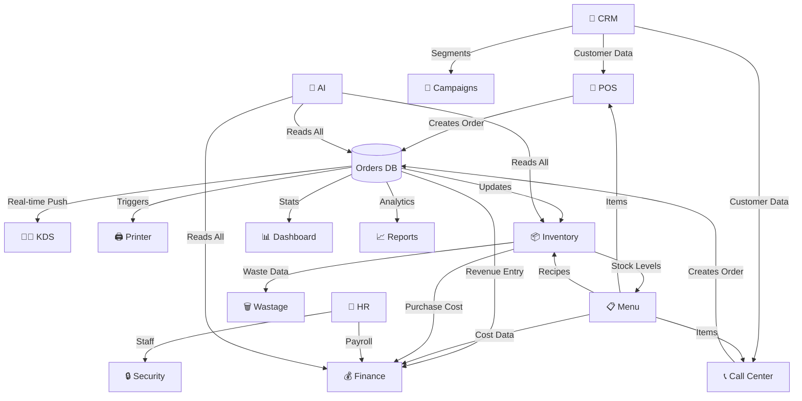

# 📖 RestoFlow ERP — System Guide | دليل النظام الكامل

> **Version 1.1.0** | Last Updated: March 2026  
> **Enterprise Restaurant & Café Management Platform**  
> منصة إدارة مطاعم وكافيهات متكاملة على مستوى المؤسسات

---

## 📑 Table of Contents | الفهرس

| # | Section | القسم |
|---|---------|-------|
| 1 | [System Overview](#1-system-overview) | نظرة عامة |
| 2 | [Technology Stack](#2-technology-stack) | المكدس التقني |
| 3 | [Module Guide](#3-module-guide) | دليل الأقسام |
| 4 | [Module Interconnections](#4-module-interconnections) | ارتباط الأقسام |
| 5 | [Database & Storage](#5-database--storage) | التخزين وقواعد البيانات |
| 6 | [Online / Offline Mode](#6-online--offline-mode) | الأونلاين والأوفلاين |
| 7 | [Hardware Requirements](#7-hardware-requirements) | المواصفات المطلوبة |
| 8 | [Installation & Setup](#8-installation--setup) | التثبيت والإعداد |
| 9 | [User Roles & Permissions](#9-user-roles--permissions) | الأدوار والصلاحيات |
| 10 | [Keyboard Shortcuts](#10-keyboard-shortcuts) | اختصارات لوحة المفاتيح |

---

## 1. System Overview
### نظرة عامة على النظام

**RestoFlow ERP** is an enterprise-grade, full-stack restaurant management platform designed for the Egyptian market. It supports **single or multi-branch** operations (up to 100+ branches) with real-time synchronization.

**RestoFlow ERP** هو نظام إدارة مطاعم متكامل مصمم للسوق المصري. يدعم فرع واحد أو عدة فروع (حتى 100+ فرع) مع مزامنة فورية.

### Key Capabilities | القدرات الأساسية

| Feature | الميزة | Status | الحالة |
|---------|--------|--------|--------|
| Point of Sale (POS) | نقطة البيع | ✅ Full | كامل |
| Kitchen Display System (KDS) | شاشة المطبخ | ✅ Full | كامل |
| Call Center & Delivery | الكول سنتر والتوصيل | ✅ Full | كامل |
| Inventory Management | إدارة المخزون | ✅ Full | كامل |
| Financial Accounting (GL) | المحاسبة المالية | ✅ Full | كامل |
| CRM & Loyalty | إدارة العملاء والولاء | ✅ Full | كامل |
| HR & People | الموارد البشرية | ✅ Full | كامل |
| Menu Engineering | هندسة القائمة | ✅ Full | كامل |
| Reports & Analytics | التقارير والتحليلات | ✅ Full | كامل |
| AI Insights | رؤى الذكاء الاصطناعي | ✅ Full | كامل |
| Multi-branch Management | إدارة الفروع | ✅ Full | كامل |
| Real-time Sync (WebSocket) | المزامنة الفورية | ✅ Full | كامل |
| Offline Mode (IndexedDB) | وضع بدون إنترنت | ✅ Full | كامل |
| Printer Integration | ربط الطابعات | ✅ Full | كامل |
| Role-Based Access (20 roles) | صلاحيات حسب الدور | ✅ Full | كامل |

---

## 2. Technology Stack
### المكدس التقني

```
┌──────────────────────────────────────────┐
│              FRONTEND (Client)           │
│  React 19 + TypeScript + Vite            │
│  State: Zustand (8 stores)               │
│  UI: TailwindCSS 4 + Lucide Icons        │
│  Charts: Recharts 3                      │
│  Offline DB: Dexie (IndexedDB)           │
│  Real-time: Socket.IO Client             │
│  Router: React Router 7                  │
├──────────────────────────────────────────┤
│              BACKEND (Server)            │
│  Express 5 + TypeScript (tsx)            │
│  ORM: Drizzle ORM                        │
│  Database: PostgreSQL (pg)               │
│  Cache: Redis                            │
│  Real-time: Socket.IO                    │
│  Auth: JWT (jsonwebtoken + bcryptjs)      │
│  AI: Google Gemini API                   │
│  PDF: PDFKit                             │
│  Email: Nodemailer                       │
│  Logging: Pino                           │
│  Validation: Zod 4                       │
│  Storage: AWS S3                         │
│  Security: Helmet + Rate Limiting        │
├──────────────────────────────────────────┤
│            HARDWARE BRIDGE               │
│  Separate Node.js process                │
│  Direct printer communication            │
│  Runs as Windows service                 │
└──────────────────────────────────────────┘
```

---

## 3. Module Guide
### دليل الأقسام — كل قسم بالتفصيل

---

### 3.1 📊 Dashboard | لوحة التحكم
**Path:** `/dashboard`

| EN | AR |
|----|-----|
| The main command center showing real-time KPIs, charts, and quick actions. | مركز القيادة الرئيسي — يعرض مؤشرات الأداء والرسوم البيانية والإجراءات السريعة. |
| Shows: Revenue, Orders, Avg Ticket, Top Items, Live Clock, Shift Timer | يعرض: الإيرادات، الطلبات، متوسط الفاتورة، الأصناف الأكثر مبيعاً، الساعة، مؤقت الوردية |
| Sparkline charts on each KPI card | رسوم بيانية مصغرة على كل بطاقة |
| Quick Actions: New Order, End Shift, View Reports | إجراءات سريعة: طلب جديد، إنهاء الوردية، عرض التقارير |
| Favorites system for quick page access | نظام المفضلة للوصول السريع للصفحات |
| System health widget showing server/DB status | ويدجيت صحة النظام (السيرفر/قاعدة البيانات) |

---

### 3.2 🛒 POS (Point of Sale) | نقطة البيع
**Path:** `/pos`

| EN | AR |
|----|-----|
| Full-featured touch-optimized POS terminal | نقطة بيع كاملة مُحسَّنة للشاشات اللمسية |
| **Menu browsing** with categories, search, and multiple views (Cards/Small/List/Buttons) | **تصفح القائمة** بالتصنيفات والبحث وعرض متعدد |
| **Cart management** with quantity, notes, modifiers | **إدارة السلة** مع الكمية والملاحظات والإضافات |
| **Payment methods**: Cash, Card, Wallet, Split | **طرق الدفع**: كاش، كارت، محفظة، تقسيم |
| **Cash calculator**: Amount tendered + Change due with quick denomination buttons (50/100/200/500/Exact) | **حاسبة الكاش**: المبلغ المدفوع + الباقي مع أزرار سريعة |
| **Discount system**: Percentage or fixed amount | **نظام الخصومات**: نسبة أو مبلغ ثابت |
| **Hold/Recall orders** (stored in localStorage) | **تعليق/استرجاع الطلبات** (مخزنة محلياً) |
| **Table assignment** (Dine-in) | **ربط بالطاولة** (الأكل في المكان) |
| **Print receipt** on order completion | **طباعة الإيصال** عند إتمام الطلب |
| **Kitchen ticket routing** by printer/station | **توجيه تذاكر المطبخ** حسب الطابعة/المحطة |

---

### 3.3 👨‍🍳 KDS (Kitchen Display System) | شاشة المطبخ
**Path:** `/kds`

| EN | AR |
|----|-----|
| Real-time kitchen order display | عرض طلبات المطبخ بشكل فوري |
| **Configurable stations** (Grill, Bar, Fryer, Dessert, Salad, Bakery + custom) | **محطات قابلة للتخصيص** (جريل، بار، قلاية، حلويات، سلطات، مخبوزات + محطات مخصصة) |
| Station Settings modal: add/remove/rename + custom keywords | إعدادات المحطات: إضافة/حذف/تسمية + كلمات مفتاحية |
| **Auto-assignment**: Items routed to stations by keyword matching | **تعيين تلقائي**: الأصناف توجَّه للمحطات عبر مطابقة الكلمات |
| **SLA Timer**: Warning (7min) → Risk (12min) → Critical (20min) | **مؤقت SLA**: تحذير (7 دقائق) → خطر (12) → حرج (20) |
| **Double-tap bump** confirmation to prevent accidental advances | **تأكيد مزدوج (لمستين)** لمنع التقديم بالخطأ |
| **Sound alerts** on new orders (Web Audio API) | **تنبيهات صوتية** عند وصول طلبات جديدة |
| **Fullscreen mode** for kitchen screens | **وضع ملء الشاشة** لشاشات المطبخ |
| **Station workload bar** showing active load per station | **شريط حمل المحطات** يوضح كثافة العمل لكل محطة |
| Auto-refresh every 5 seconds | تحديث تلقائي كل 5 ثوانٍ |

---

### 3.4 📞 Call Center | الكول سنتر
**Path:** `/call-center`

| EN | AR |
|----|-----|
| Smart Phone-first order taking system | نظام أخذ طلبات ذكي عبر التليفون |
| **Live auto-complete search**: Start typing phone/name → see matching customers instantly | **بحث تلقائي مباشر**: ابدأ بكتابة الرقم/الاسم → يظهر العملاء المطابقين فوراً |
| **Auto-load on exact match**: Full profile opens when number matches exactly | **تحميل تلقائي**: ملف العميل الكامل يفتح لما الرقم يتطابق بالظبط |
| **Rich customer profile**: Full details, loyalty tier, order history | **ملف عميل متكامل**: كل البيانات، درجة الولاء، تاريخ الطلبات |
| **Last order breakdown**: Every item with quantity, price, total + Re-order button | **تفاصيل آخر طلب**: كل صنف بالكمية والسعر + زر إعادة الطلب |
| **3 Action buttons**: New Order, Edit Customer, Print Report | **3 أزرار**: طلب جديد، تعديل العميل، طباعة تقرير |
| **Print customer report**: Opens printer-friendly window with all data | **طباعة تقرير العميل**: يفتح نافذة طباعة مرتبة بكل البيانات |
| **Auto-register**: If customer not found → registration modal | **تسجيل تلقائي**: لو العميل مش مسجل → مودال تسجيل |
| **Call timer** with active/idle status | **مؤقت المكالمة** مع حالة نشط/انتظار |
| **Driver assignment** for delivery orders | **تعيين السائق** لطلبات التوصيل |
| **Order tracking view**: Grid/List with status filters | **شاشة متابعة الطلبات**: شبكة/قائمة مع فلاتر الحالة |
| **Held orders system** (persisted to localStorage) | **نظام تعليق الطلبات** (مخزن محلياً) |

---

### 3.5 📋 Menu Manager | مدير القائمة
**Path:** `/menu`

| EN | AR |
|----|-----|
| Complete menu engineering with categories & items | هندسة قائمة كاملة بالتصنيفات والأصناف |
| Add/edit/delete categories and items | إضافة/تعديل/حذف التصنيفات والأصناف |
| **Pricing**: Base price, cost price, margin calculation | **التسعير**: سعر أساسي، سعر التكلفة، حساب الهامش |
| **Profit Center**: Margin analysis per item | **مركز الربحية**: تحليل الهامش لكل صنف |
| **Modifiers/Add-ons**: Size, extras, customizations | **الإضافات**: الحجم، إضافات، تخصيصات |
| **Item availability** toggle (in-stock/out-of-stock) | **توفر الصنف** (متوفر/غير متوفر) |
| **Image upload** for menu items | **رفع الصور** للأصناف |
| **Recipe linking** to inventory items | **ربط الوصفات** بأصناف المخزون |

**📗 Recipe Manager** (`/recipes`): Define recipes with ingredients, quantities, and preparation steps.  
**مدير الوصفات**: تعريف الوصفات بالمكونات والكميات وخطوات التحضير.

---

### 3.6 📦 Inventory | المخزون
**Path:** `/inventory`

| EN | AR |
|----|-----|
| Enterprise inventory management system | نظام إدارة مخزون متقدم |
| **Stock overview** with sorting (Name/Qty↑/Qty↓/Cost/Low-First) | **نظرة عامة على المخزون** مع ترتيب متعدد |
| **Low stock alerts** with configurable thresholds | **تنبيهات نقص المخزون** بحدود قابلة للضبط |
| **Warehouses** management per branch | **إدارة المخازن** لكل فرع |
| **Suppliers** database | **قاعدة بيانات الموردين** |
| **Purchase Orders** creation and tracking | **أوامر الشراء** — إنشاء ومتابعة |
| **Branch transfers** and logistics | **التحويلات بين الفروع** واللوجستيات |
| **Batch tracking** with FEFO (First Expired, First Out) | **تتبع الدفعات** مع نظام FEFO |

**📊 Inventory Intelligence** (`/inventory-intelligence`): AI-powered demand forecasting.  
**ذكاء المخزون**: توقع الطلب باستخدام الذكاء الاصطناعي.

**🗑️ Wastage Manager** (`/wastage`): Track and analyze food waste.  
**مدير الهالك**: تتبع وتحليل الهدر الغذائي.

---

### 3.7 💰 Finance | المالية
**Path:** `/finance`

| EN | AR |
|----|-----|
| Full double-entry accounting (General Ledger) | محاسبة القيد المزدوج الكاملة (دفتر الأستاذ) |
| **Chart of Accounts**: Assets, Liabilities, Equity, Revenue, Expenses | **شجرة الحسابات**: أصول، خصوم، حقوق ملكية، إيرادات، مصروفات |
| **Journal Entries** with date range filter + text search | **قيود اليومية** مع فلتر تاريخ + بحث نصي |
| **Financial statements**: Balance Sheet, Income Statement | **القوائم المالية**: الميزانية العمومية، قائمة الدخل |
| **Account reconciliation** | **تسوية الحسابات** |
| **Period closing** (month-end/year-end) | **إقفال الفترات** (نهاية الشهر/السنة) |

**🏛️ Fiscal Hub** (`/fiscal`): Tax settings and compliance for Egyptian regulations.  
**المركز الضريبي**: إعدادات الضرائب والامتثال للقوانين المصرية.

**📑 Day Close** (`/day-close`): End-of-day reconciliation and shift closing.  
**إقفال اليوم**: تسوية نهاية اليوم وإقفال الورديات.

---

### 3.8 👥 CRM | إدارة العملاء
**Path:** `/crm`

| EN | AR |
|----|-----|
| Customer Relationship Management | إدارة علاقات العملاء |
| **Customer database** with search and filters | **قاعدة بيانات العملاء** مع البحث والفلاتر |
| **Loyalty tiers**: Bronze → Silver → Gold → Platinum | **درجات الولاء**: برونز → فضي → ذهبي → بلاتيني |
| **Customer tags** (AI-generated) | **تصنيفات العملاء** (يولدها الذكاء الاصطناعي) |
| **Order history** per customer | **تاريخ الطلبات** لكل عميل |
| **Profile drawer** with deep analytics | **درج الملف الشخصي** مع تحليلات متقدمة |

**📢 Campaign Hub** (`/campaigns`): Marketing campaigns and promotions.  
**مركز الحملات**: حملات التسويق والعروض الترويجية.

**💬 WhatsApp Hub** (`/whatsapp`): WhatsApp business integration.  
**مركز واتساب**: ربط واتساب بزنس.

---

### 3.9 👤 HR & People (ZenPeople) | الموارد البشرية
**Path:** `/people`

| EN | AR |
|----|-----|
| Complete HR management module | قسم إدارة موارد بشرية كامل |
| **Employee profiles** and documents | **ملفات الموظفين** والمستندات |
| **Attendance tracking** | **تتبع الحضور والانصراف** |
| **Payroll processing** | **إعداد المرتبات** |
| **Leave management** | **إدارة الإجازات** |
| **Performance reviews** | **تقييمات الأداء** |
| **Shift scheduling** | **جدولة الورديات** |

---

### 3.10 📈 Reports & Analytics | التقارير والتحليلات
**Path:** `/reports`

| EN | AR |
|----|-----|
| Comprehensive reporting engine | محرك تقارير شامل |
| **Sales reports**: Daily, weekly, monthly, custom range | **تقارير المبيعات**: يومي، أسبوعي، شهري، مخصص |
| **Product mix** analysis | **تحليل مزيج المنتجات** |
| **Staff performance** reports | **تقارير أداء الموظفين** |
| **Branch comparison** reports | **تقارير مقارنة الفروع** |
| **Export** to PDF/CSV | **تصدير** إلى PDF/CSV |

---

### 3.11 🤖 AI Insights | رؤى الذكاء الاصطناعي
**Path:** `/ai-insights` + `/ai-assistant`

| EN | AR |
|----|-----|
| AI-powered business intelligence (Google Gemini API) | ذكاء أعمال بالذكاء الاصطناعي (Google Gemini) |
| **Sales predictions** and trend analysis | **توقعات المبيعات** وتحليل الاتجاهات |
| **Menu optimization** suggestions | **اقتراحات تحسين القائمة** |
| **Staffing recommendations** | **توصيات التوظيف** |
| **AI Chat Assistant** for natural language queries | **مساعد ذكاء اصطناعي** للأسئلة بلغة طبيعية |

---

### 3.12 Other Modules | أقسام أخرى

| Module | المسار | EN | AR |
|--------|--------|-----|-----|
| **Security Hub** | `/security` | User management, roles (20), permissions (20+) | إدارة المستخدمين والأدوار (20) والصلاحيات |
| **Settings** | `/settings` | System configuration, language, theme, branding | إعدادات النظام، اللغة، الثيم، الهوية |
| **Floor Designer** | `/floor-designer` | Visual table layout designer (drag & drop) | مصمم تخطيط الطاولات بالسحب والإفلات |
| **Printer Manager** | `/printers` | Configure receipt/kitchen printers, routing rules | إعداد طابعات الإيصالات/المطبخ والتوجيه |
| **Production** | `/production` | Kitchen production planning | تخطيط إنتاج المطبخ |
| **Dispatch Hub** | `/dispatch` | Delivery driver management & routing | إدارة سائقي التوصيل والتوجيه |
| **Refund Manager** | `/refunds` | Process refunds with approval workflow | معالجة المرتجعات مع سير عمل الموافقة |
| **Approval Center** | `/approvals` | Multi-level approval workflows | سير عمل الموافقات متعدد المستويات |
| **Platform Aggregator** | `/platforms` | Talabat, Elmenus, etc. integration | ربط طلبات، المنيوز، إلخ |
| **Franchise Manager** | `/franchise` | Franchise operations management | إدارة عمليات الفرانشايز |
| **Forensics Hub** | `/forensics` | Audit trail and investigation tools | تتبع المراجعة وأدوات التحقيق |
| **Go Live Center** | `/go-live` | Launch readiness checklist | قائمة جاهزية الإطلاق |
| **Setup Wizard** | `/setup` | Initial system configuration wizard | معالج إعداد النظام الأولي |

---

## 4. Module Interconnections
### ارتباط الأقسام ببعضها



### Key Data Flows | تدفقات البيانات الرئيسية

| Flow | التدفق | Description | الوصف |
|------|--------|-------------|-------|
| **Order → KDS** | طلب → شاشة المطبخ | Real-time via Socket.IO | فوري عبر WebSocket |
| **Order → Inventory** | طلب → المخزون | Auto-deducts ingredients based on recipes | يخصم المكونات تلقائياً حسب الوصفات |
| **Order → Finance** | طلب → المالية | Creates journal entry (Debit: Cash/Card, Credit: Revenue) | ينشئ قيد يومية |
| **Order → Printer** | طلب → الطابعة | Kitchen tickets routed by station/printer rules | تذاكر المطبخ تُوَجَّه حسب قواعد المحطة/الطابعة |
| **CRM → POS/CC** | العملاء → البيع/الكول سنتر | Customer lookup, loyalty, order history | بحث عن العملاء، الولاء، تاريخ الطلبات |
| **Menu → Inventory** | القائمة → المخزون | Recipe ingredients link to stock items | مكونات الوصفة مرتبطة بأصناف المخزون |
| **HR → Finance** | الموارد البشرية → المالية | Payroll generates journal entries | المرتبات تُنشئ قيود يومية |

---

## 5. Database & Storage
### التخزين وقواعد البيانات

### 5.1 What's Stored in PostgreSQL (Server DB) | ما يُخزَّن في قاعدة البيانات

| Data | البيانات | Stored? | مخزّن؟ |
|------|---------|---------|--------|
| Users & Authentication | المستخدمون والتوثيق | ✅ Yes — PostgreSQL | نعم |
| Orders (all types) | الطلبات (كل الأنواع) | ✅ Yes — PostgreSQL | نعم |
| Menu Categories & Items | التصنيفات والأصناف | ✅ Yes — PostgreSQL | نعم |
| Customers (CRM) | العملاء | ✅ Yes — PostgreSQL | نعم |
| Inventory Items & Stock | أصناف المخزون | ✅ Yes — PostgreSQL | نعم |
| Warehouses | المخازن | ✅ Yes — PostgreSQL | نعم |
| Suppliers | الموردين | ✅ Yes — PostgreSQL | نعم |
| Purchase Orders | أوامر الشراء | ✅ Yes — PostgreSQL | نعم |
| Financial Transactions | المعاملات المالية | ✅ Yes — PostgreSQL | نعم |
| Chart of Accounts | شجرة الحسابات | ✅ Yes — PostgreSQL | نعم |
| Employees (HR) | الموظفون | ✅ Yes — PostgreSQL | نعم |
| Branches | الفروع | ✅ Yes — PostgreSQL | نعم |
| Printers & Routing | الطابعات والتوجيه | ✅ Yes — PostgreSQL | نعم |
| Floor Plans & Tables | خرائط الطوابق والطاولات | ✅ Yes — PostgreSQL | نعم |
| Audit Logs | سجلات المراجعة | ✅ Yes — PostgreSQL | نعم |
| Settings | الإعدادات | ✅ Yes — PostgreSQL | نعم |
| Delivery Zones | مناطق التوصيل | ✅ Yes — PostgreSQL | نعم |

### 5.2 What's Cached in Redis | ما يُخزَّن في Redis

| Data | Purpose |
|------|---------|
| Session tokens | Fast auth validation |
| Socket.IO adapter | Multi-server real-time sync |
| Rate limiting counters | API protection |
| Frequently accessed data | Performance optimization |

### 5.3 What's Stored Locally (Browser) | ما يُخزَّن محلياً في المتصفح

| Data | Location | Purpose | الغرض |
|------|----------|---------|-------|
| Auth token + user | `localStorage` | Persist login session | استمرار الجلسة |
| KDS station config | `localStorage` | Custom station settings | إعدادات محطات المطبخ |
| Held orders (POS/CC) | `localStorage` | Orders parked for later | طلبات معلقة |
| Full offline mirror | `IndexedDB (Dexie)` | Offline operation | العمل بدون إنترنت |

### 5.4 IndexedDB Offline Tables (Dexie) | جداول IndexedDB

The system maintains a **complete local mirror** for offline operation:

| Table | البيانات | Indexed By |
|-------|---------|------------|
| `orders` | Orders | id, status, syncStatus, createdAt |
| `menuCategories` | Menu categories | id, updatedAt |
| `menuItems` | Menu items | id, categoryId, updatedAt |
| `customers` | Customers | id, phone, updatedAt |
| `inventoryItems` | Inventory | id, updatedAt |
| `warehouses` | Warehouses | id, branchId, updatedAt |
| `settings` | Settings | key, updatedAt |
| `users` | Users | id, email |
| `branches` | Branches | id |
| `auditLogs` | Audit trail | id, createdAt |
| `floorTables` | Tables | id, branchId |
| `floorZones` | Zones | id, branchId |
| `syncQueue` | Pending syncs | id, status, entity, dedupeKey |

---

## 6. Online / Offline Mode
### الأونلاين والأوفلاين

### How It Works | كيف يعمل

```
┌─────────────────────────────────────────────────┐
│                    ONLINE MODE                    │
│                                                   │
│  Browser ←→ Express API ←→ PostgreSQL             │
│     ↕           ↕                                 │
│  IndexedDB   Socket.IO ←→ Redis (multi-server)    │
│  (mirror)       ↓                                 │
│              Other clients (KDS, POS, etc.)       │
├─────────────────────────────────────────────────┤
│                   OFFLINE MODE                    │
│                                                   │
│  Browser ←→ IndexedDB (Dexie)                     │
│              ↓                                    │
│  syncQueue stores all mutations                   │
│              ↓ (when back online)                 │
│  Auto-sync: PENDING → API → PostgreSQL → SYNCED   │
│  De-duplication by dedupeKey                      │
│  Retry with exponential backoff                   │
└─────────────────────────────────────────────────┘
```

| Feature | EN | AR |
|---------|-----|-----|
| **Take orders offline** | ✅ Orders saved to IndexedDB with `syncStatus: PENDING` | ✅ الطلبات تُحفظ في IndexedDB بحالة "في الانتظار" |
| **Browse menu offline** | ✅ Full menu cached in IndexedDB | ✅ القائمة الكاملة مخزنة محلياً |
| **View customer data** | ✅ Customer data cached locally | ✅ بيانات العملاء مخزنة محلياً |
| **Auto-sync on reconnect** | ✅ syncQueue processes PENDING items | ✅ صف المزامنة يعالج العناصر المعلقة |
| **Conflict resolution** | ✅ De-duplication by dedupeKey | ✅ منع التكرار بمفتاح التفريد |
| **Retry failed syncs** | ✅ Automatic retry with metadata tracking | ✅ إعادة المحاولة تلقائياً مع تتبع |
| **Real-time updates** | Via Socket.IO — KDS, POS get live order updates | عبر Socket.IO — المطبخ والبيع يتلقون تحديثات فورية |

### Limitations in Offline Mode | قيود وضع الأوفلاين

| Feature | Status | الحالة |
|---------|--------|--------|
| Financial journal entries | ⚠️ Queued, synced when online | تُوضع في الطابور وتُزامَن عند الاتصال |
| Reports generation | ❌ Requires server | يتطلب الاتصال بالسيرفر |
| AI Insights | ❌ Requires API | يتطلب API |
| User creation | ❌ Requires server | يتطلب الاتصال بالسيرفر |
| Driver assignment | ❌ Requires server | يتطلب الاتصال بالسيرفر |

---

## 7. Hardware Requirements
### المواصفات المطلوبة

### 7.1 Server (for 1–10 branches) | السيرفر

| Component | Minimum | Recommended | الموصى به |
|-----------|---------|-------------|-----------|
| **CPU** | 2 cores | 4+ cores | 4+ أنوية |
| **RAM** | 4 GB | 8–16 GB | 8–16 جيجا |
| **Storage** | 50 GB SSD | 100+ GB SSD | 100+ جيجا SSD |
| **OS** | Ubuntu 22.04 / Windows Server 2019+ | Ubuntu 24.04 | Ubuntu 24.04 |
| **Network** | 10 Mbps | 50+ Mbps | 50+ ميجابت |

### 7.2 Server (for 10–100 branches) | السيرفر للفروع الكبيرة

| Component | Recommended | الموصى به |
|-----------|-------------|-----------|
| **CPU** | 8+ cores | 8+ أنوية |
| **RAM** | 32 GB | 32 جيجا |
| **Storage** | 500 GB NVMe SSD | 500 جيجا NVMe |
| **Database** | Dedicated PostgreSQL server or managed (AWS RDS/DigitalOcean) | سيرفر قاعدة بيانات مخصص |
| **Redis** | Dedicated Redis server | سيرفر Redis مخصص |
| **Load Balancer** | Nginx / AWS ALB | موزع أحمال |

### 7.3 POS Terminal | جهاز نقطة البيع

| Component | Minimum | Recommended | الموصى به |
|-----------|---------|-------------|-----------|
| **Device** | Any with modern browser | Touch-screen PC/Tablet | كمبيوتر/تابلت شاشة لمس |
| **Browser** | Chrome 90+ / Edge 90+ | Chrome latest | أحدث Chrome |
| **RAM** | 2 GB | 4+ GB | 4+ جيجا |
| **Screen** | 10" (1024×768) | 14–15" (1920×1080) | 14–15 بوصة Full HD |
| **Network** | WiFi 5 GHz | Wired Ethernet | سلك إيثرنت |

### 7.4 KDS Screen | شاشة المطبخ

| Component | Recommended | الموصى به |
|-----------|-------------|-----------|
| **Screen** | 15–22" LCD/LED | 15–22 بوصة |
| **Resolution** | 1920×1080 | Full HD |
| **Protection** | Splash-proof enclosure | غلاف ضد الماء |
| **Mount** | Wall/shelf mounted | تعليق على الحائط |
| **Device** | Mini PC / Stick PC / Tablet | كمبيوتر صغير / تابلت |

### 7.5 Printers | الطابعات

| Type | Recommended | الموصى به |
|------|-------------|-----------|
| **Receipt Printer** | Epson TM-T20III / Star TSP143 (Thermal 80mm) | طابعة حرارية 80 مم |
| **Kitchen Printer** | Epson TM-T20III (Thermal, splash-proof) | طابعة حرارية مقاومة للماء |
| **Connection** | USB → Hardware Bridge | USB عبر Hardware Bridge |

### 7.6 Network Requirements | متطلبات الشبكة

| Requirement | Details | التفاصيل |
|-------------|---------|----------|
| **Internet** | Minimum 10 Mbps (per branch) | 10 ميجابت على الأقل لكل فرع |
| **LAN** | All POS/KDS on same network | كل الأجهزة على نفس الشبكة |
| **WiFi** | 5 GHz preferred (less interference) | 5 جيجاهرتز مفضل (تداخل أقل) |
| **Failover** | Mobile hotspot as backup | نقطة اتصال موبايل كاحتياطي |
| **Ports** | 3000 (API), 5173 (Vite), 9632 (Print Bridge) | المنافذ المطلوبة |

---

## 8. Installation & Setup
### التثبيت والإعداد

### Prerequisites | المتطلبات الأساسية
```
Node.js 18+
PostgreSQL 15+
Redis 7+ (optional, for production)
Git
```

### Quick Start | البداية السريعة
```bash
# 1. Clone & Install
git clone <repo-url> && cd restoflow-erp
npm install

# 2. Setup environment
cp .env.example .env
# Edit .env with your DATABASE_URL, JWT_SECRET, etc.

# 3. Initialize database
npm run db:push

# 4. Bootstrap auth (create admin user)
npm run ops:dev:init

# 5. Start full development stack
npm run dev:all
# → Frontend: http://localhost:5173
# → Backend:  http://localhost:3000

# 6. (Optional) Start hardware print bridge
npm run bridge:install && npm run bridge:start
```

### Production Deployment | النشر على الإنتاج
```bash
# Build frontend
npm run build

# Start production server
npm run server:prod

# OR use Docker
npm run docker:prod:build
npm run docker:prod:up
```

---

## 9. User Roles & Permissions
### الأدوار والصلاحيات

The system has **20 built-in roles** with granular permissions:

| Role | الدور | Access |
|------|------|--------|
| `ADMIN` | مدير النظام | Full access to everything |
| `OWNER` | مالك | Full business access |
| `MANAGER` | مدير الفرع | Branch management |
| `CASHIER` | كاشير | POS only |
| `WAITER` | ويتر | POS + Tables |
| `CHEF` | شيف | KDS only |
| `CALL_CENTER` | كول سنتر | Call Center + Tracking |
| `INVENTORY_STAFF` | مخازن | Inventory management |
| `WAREHOUSE_DIRECTOR` | مدير مخازن | Full inventory control |
| `ACCOUNTANT` | محاسب | Finance & Reports |
| `COST_ACCOUNTANT` | محاسب تكاليف | Menu costing & analysis |
| `FINANCE_DIRECTOR` | مدير مالي | Full financial access |
| `HR` | موارد بشرية | HR module |
| `PAYROLL` | مرتبات | Payroll processing |
| `PROCUREMENT` | مشتريات | Purchase orders |
| `PRODUCTION` | إنتاج | Production planning |
| `TREASURY` | خزينة | Cash management |
| `TECH_SUPPORT` | دعم فني | Settings & Configuration |
| `QUALITY` | جودة | Quality control |
| `VIEWER` | مشاهد | Read-only access |

---

## 10. Keyboard Shortcuts
### اختصارات لوحة المفاتيح

| Shortcut | Action | الإجراء |
|----------|--------|---------|
| `F1` | Focus phone search (Call Center) | التركيز على البحث بالتليفون |
| `F5` | New call / Reset order | مكالمة جديدة / إعادة تعيين |
| `Escape` | Close modal / Cancel | إغلاق المودال / إلغاء |
| `Enter` | Confirm / Submit | تأكيد / إرسال |

---

## 📌 Summary | الملخص

**RestoFlow ERP** is a **complete, production-ready** system that:

- ✅ Stores **ALL critical data** in PostgreSQL (orders, inventory, finance, HR, CRM)
- ✅ Maintains a **full offline mirror** via IndexedDB (Dexie) with automatic sync
- ✅ Provides **real-time updates** across all screens via Socket.IO + Redis
- ✅ Supports **20 user roles** with fine-grained permissions
- ✅ Runs on **any modern browser** — no native app needed
- ✅ Handles **1 to 100+ branches** with horizontal scaling
- ✅ Integrates with **thermal printers** via Hardware Bridge
- ✅ Powered by **AI** (Google Gemini) for insights and predictions

**RestoFlow ERP** هو نظام **كامل وجاهز للإنتاج**:

- ✅ يخزن **كل البيانات الحرجة** في PostgreSQL
- ✅ يحتفظ بـ **نسخة محلية كاملة** عبر IndexedDB مع مزامنة تلقائية
- ✅ يوفر **تحديثات فورية** عبر كل الشاشات عبر Socket.IO + Redis
- ✅ يدعم **20 دور وظيفي** بصلاحيات دقيقة
- ✅ يعمل على **أي متصفح حديث** — بدون تطبيق
- ✅ يتعامل مع **1 إلى 100+ فرع** مع التوسع الأفقي
- ✅ يتكامل مع **الطابعات الحرارية** عبر Hardware Bridge
- ✅ مدعوم بـ **الذكاء الاصطناعي** (Google Gemini)
